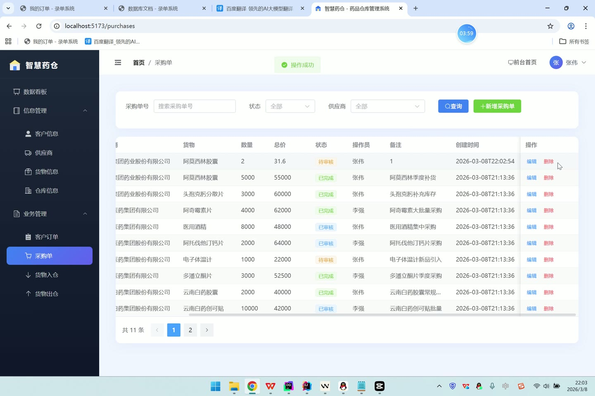
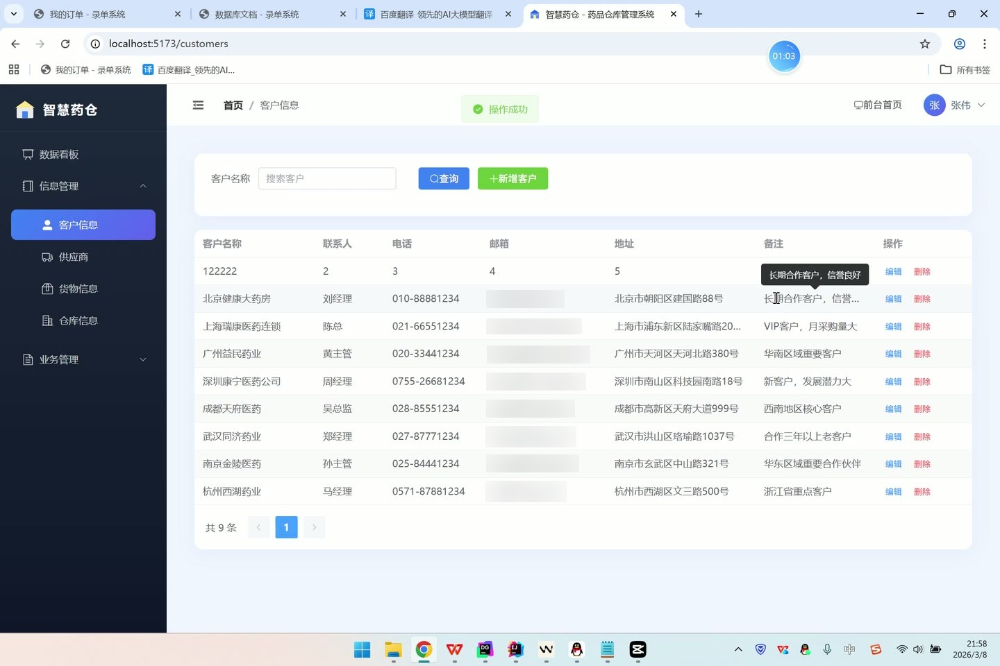
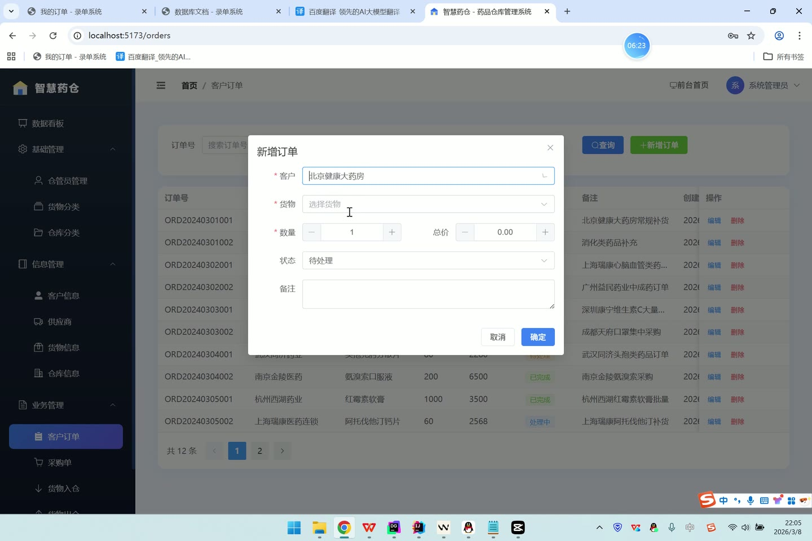
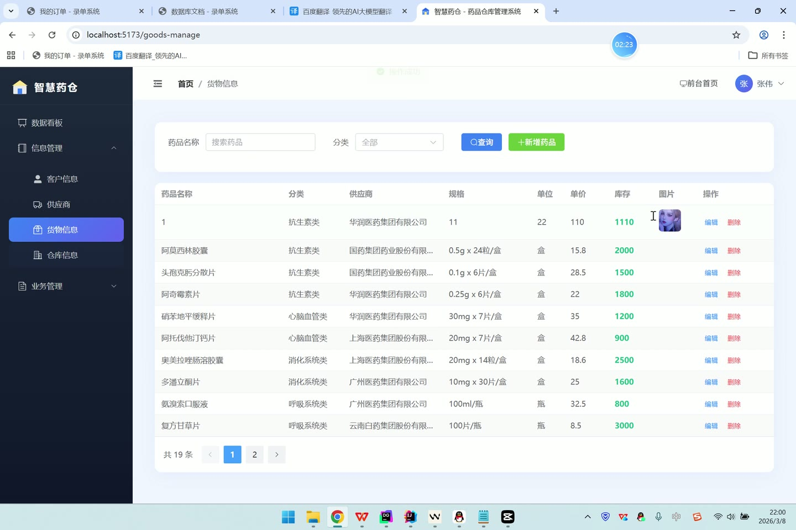
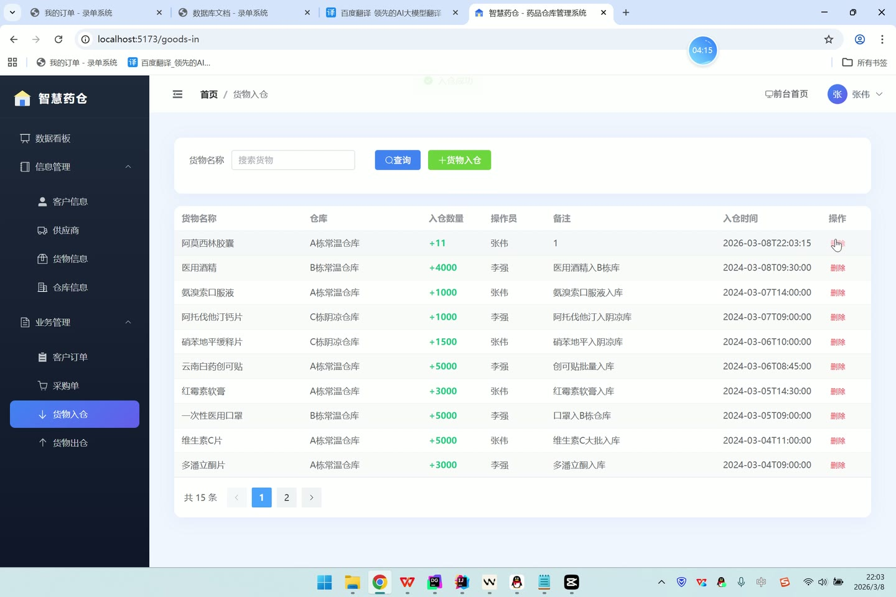

# (附文档)Springboot3+Vue3+MySQL 药品仓库管理系统

**技术栈**：Springboot3、Vue3、MySQL

### 系统简介

本系统是一套基于 SpringBoot3 + Vue3 + MySQL 的药品仓库管理系统，采用前后端分离架构。系统内置管理员（ADMIN）与仓管员（KEEPER）两种角色，覆盖药品信息管理、仓库管理、出入库操作、采购订单、客户订单、供应商与客户档案、数据统计等完整仓储业务流程。前端提供门户商品展示页与后台管理界面，后端提供 RESTful API 接口服务。
 
### 核心功能
 
### 普通用户端

- 浏览药品列表：查看药品名称、分类、规格、单位、价格、库存数量等基础信息，支持按名称与分类筛选

- 药品详情查看：查看药品完整信息，包括供应商名称、药品描述、图片等详细资料

- 门户首页展示：查看系统品牌介绍与核心功能展示

- 用户注册：填写用户名、密码、真实姓名、手机号完成注册，注册后默认分配仓管员角色

- 用户登录：输入账号密码登录，支持管理员与仓管员快捷登录入口

- 登录状态保持：登录成功后获取 JWT Token 并存储用户信息至本地
 
### 管理员端

- 数据概览：统计药品总数、仓库总数、订单总数、客户总数、供应商总数并展示

- 仓管员管理：查看仓管员账号列表（支持按用户名/角色筛选）、新增或编辑仓管员账号、重置密码、启用/禁用账号、删除账号

- 药品分类管理：查看分类列表（按排序号排列）、新增或编辑药品分类（名称、描述、排序）、删除分类

- 仓库分类管理：查看仓库分类列表（按排序号排列）、新增或编辑仓库分类（名称、描述、排序）、删除分类

- 出入库统计图表：查看每月入库总量与出库总量统计数据（按月分组汇总）

- 客户管理：查看客户列表（支持按姓名模糊搜索）、新增或编辑客户信息（联系人、电话、邮箱、地址、备注）、删除客户

- 供应商管理：查看供应商列表（支持按名称模糊搜索）、新增或编辑供应商信息（联系人、电话、邮箱、地址、描述）、删除供应商

- 个人资料：查看与编辑当前登录账号的个人信息（真实姓名、手机号、邮箱、头像）
 
### 仓管员端

- 药品管理：查看药品列表（支持按名称/分类筛选）、新增或编辑药品（名称、分类、供应商、规格、单位、价格、库存、图片、描述）、删除药品

- 仓库管理：查看仓库列表（支持按名称/分类筛选）、新增或编辑仓库（名称、分类、地址、容量、当前库存、负责人、电话、图片、描述、状态）、删除仓库

- 药品入库：选择药品与仓库、填写入库数量与备注，提交后自动增加药品库存与仓库当前库存

- 药品出库：选择药品与仓库、填写出库数量与备注（可关联订单），提交时校验库存是否充足，自动扣减药品库存与仓库当前库存

- 入库记录查询：查看入库记录列表（支持按药品名称搜索），展示入库药品、仓库、经办人、数量、时间

- 出库记录查询：查看出库记录列表（支持按药品名称搜索），展示出库药品、仓库、经办人、数量、时间

- 客户订单管理：查看订单列表（支持按订单号/状态/客户筛选）、新增或编辑订单（自动生成订单号、选择客户与药品、填写数量、计算总价、设置状态与备注）、删除订单

- 采购订单管理：查看采购单列表（支持按订单号/状态/供应商筛选）、新增或编辑采购单（自动生成单号、选择供应商与药品、填写数量、计算总价、设置状态与备注）、删除采购单

- 客户档案：查看客户列表（支持按姓名搜索）、新增或编辑客户信息（联系人、电话、邮箱、地址、备注）、删除客户

- 供应商档案：查看供应商列表（支持按名称搜索）、新增或编辑供应商信息（联系人、电话、邮箱、地址、描述）、删除供应商

- 个人资料：查看与编辑当前登录账号的个人信息（真实姓名、手机号、邮箱、头像）
 
### 技术栈

后端框架SpringBoot 3.x
ORMMyBatis-Plus（含分页插件、自动填充）
权限认证JWT（jjwt）+ BCrypt 密码加密 + 自定义拦截器
前端框架Vue 3（Composition API + script setup）
状态管理Pinia（用户登录状态管理）
构建工具Vite
UI 组件库Element Plus
路由Vue Router（含路由守卫、角色权限控制）
数据库MySQL 8.x
文件上传MultipartFile 本地存储（UUID 重命名）
 
### 交付内容

- 后端完整源码

- 前端完整源码

- 数据库初始化脚本

- 万字文档

## 界面展示

---

## 获取完整源码 + 万字文档

本仓库为项目介绍页。**完整前后端源码、数据库初始化脚本、万字项目文档**，请加微信 `kangkangcode`，或访问 [codekk.top](http://codekk.top) 获取。

可作课程设计 / 毕业设计参考，支持远程部署调试。